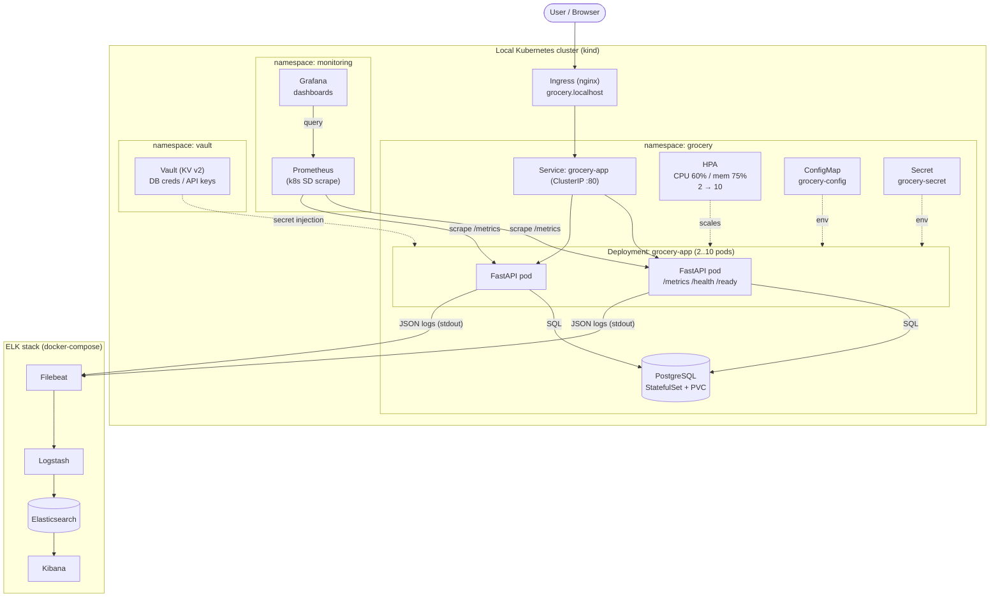

# Architecture — Grocery Delivery Platform

Component-level view of the platform: application, database, Kubernetes,
monitoring/logging, and secrets. Everything runs on **local/self-hosted**
infrastructure (Docker + kind) — no AWS managed services.

## Component responsibilities
| Component | Role |
|-----------|------|
| **FastAPI app** | Orders, inventory, delivery assignment; exposes `/metrics`, `/health`, `/ready` |
| **PostgreSQL** | Durable store for products, orders, deliveries (StatefulSet + PVC) |
| **Ingress (nginx)** | External entrypoint at `grocery.localhost` |
| **HPA** | Horizontal autoscaling 2→10 on CPU/memory for peak demand |
| **ConfigMap / Secret** | Non-secret config / credentials (Vault-backed in prod) |
| **Prometheus** | Scrapes app metrics via Kubernetes service discovery + alert rules |
| **Grafana** | Dashboards for orders, request rate, p95 latency, status codes |
| **ELK** | Centralized structured logs: Filebeat → Logstash → Elasticsearch → Kibana |
| **Vault** | Central secret store for DB creds / API keys, injected at app startup |

## How it addresses the problem statement
- **Order processing delays** → async-capable FastAPI + indexed Postgres + clear
  order state machine.
- **Scaling issues** → Kubernetes HPA scales pods automatically under load.
- **Deployment bottlenecks** → Jenkins CI/CD with automated build/test/deploy and
  Terraform-provisioned, reproducible infra.
- **Poor monitoring** → Prometheus/Grafana metrics + ELK logs + alert rules.
