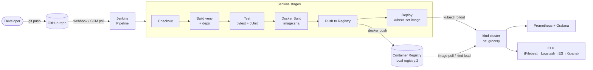

# Deployment / CI-CD Flow — Grocery Delivery Platform

End-to-end pipeline from source control to the running cluster.
GitHub → Jenkins → Docker → Kubernetes (all self-hosted; no cloud-managed steps).

## Flow summary
1. **Developer** pushes code to **GitHub**.
2. **Jenkins** triggers on the change and runs the pipeline.
3. **Checkout → Build → Test** validate the change (`pytest`, JUnit report).
4. **Docker Build** produces an image tagged with the short Git SHA.
5. **Push to Registry** publishes `:sha` and `:latest` to the registry.
6. **Deploy** rolls the image onto the kind cluster via `kubectl set image` and
   waits for `rollout status`.
7. The running app is observed by **Prometheus/Grafana** (metrics) and **ELK** (logs).

## Provisioning path (Terraform)
Infrastructure (network, Postgres, app, local registry) is provisioned with
**Terraform + the local Docker provider** — see `terraform/` and
`docs/04-terraform.md`. Kubernetes objects are applied from `k8s/` (Step 5).
