# Evidence Gallery — Grocery Delivery Platform

Screenshots captured from the **live running** stacks on a local Docker Desktop +
kind environment. 24 shots across all 7 stacks.

## 1. Application
| Evidence | Shot |
|----------|------|
| pytest — 6 tests passing | 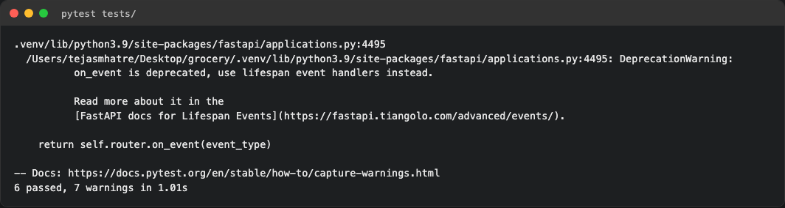 |

## 2. Docker
| Evidence | Shot |
|----------|------|
| Dashboard (served from container, live orders) | 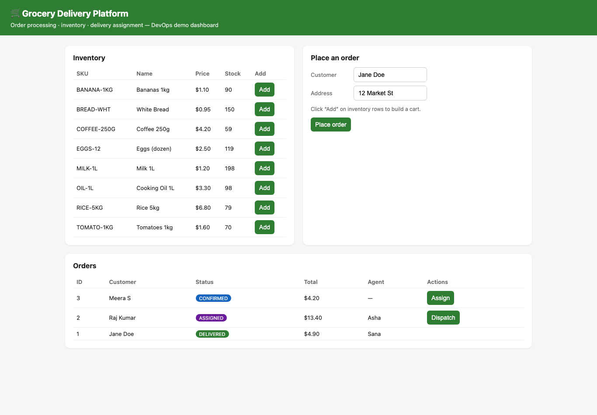 |
| Swagger / OpenAPI docs | 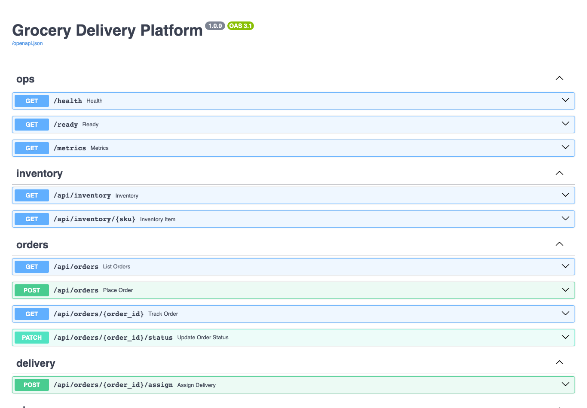 |
| `docker compose ps` (app + db healthy) | 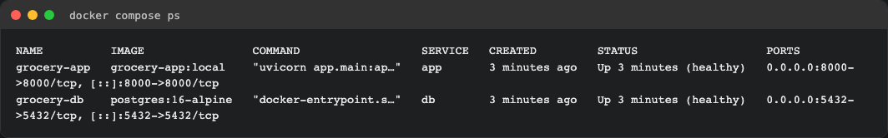 |
| `docker images` | 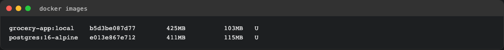 |

## 3. Jenkins CI/CD
| Evidence | Shot |
|----------|------|
| Pipeline builds #2/#3 green, 6 tests passing trend | 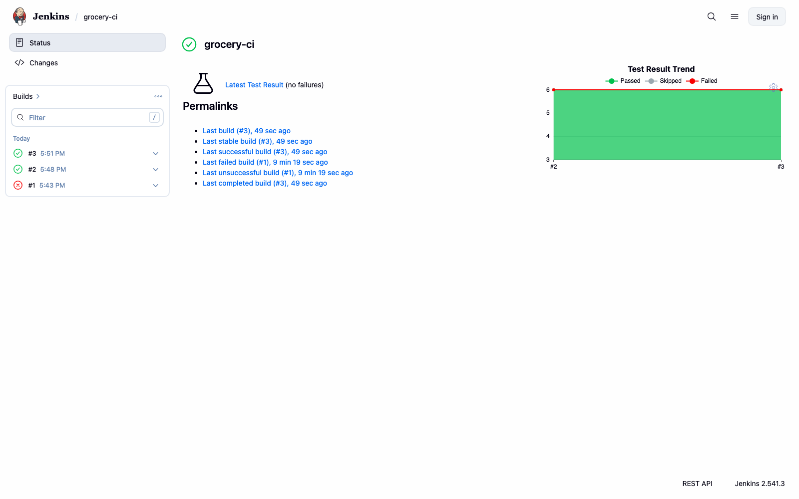 |
| Console — all stages SUCCESS | 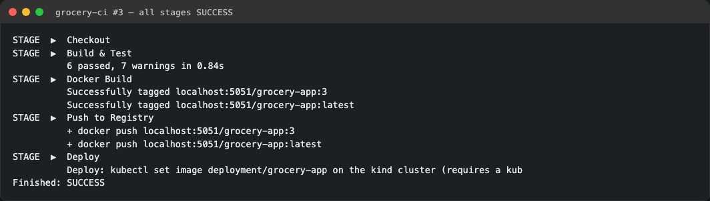 |
| Build detail (git revision, tests) | 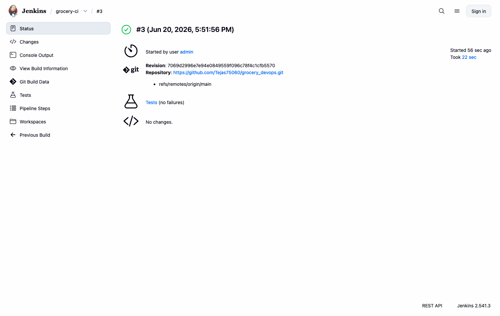 |
| Jenkins dashboard | 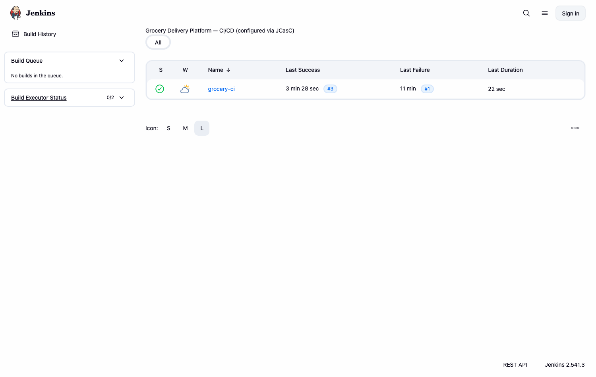 |

## 4. Terraform (local Docker provider)
| Evidence | Shot |
|----------|------|
| `terraform apply` — 8 resources | 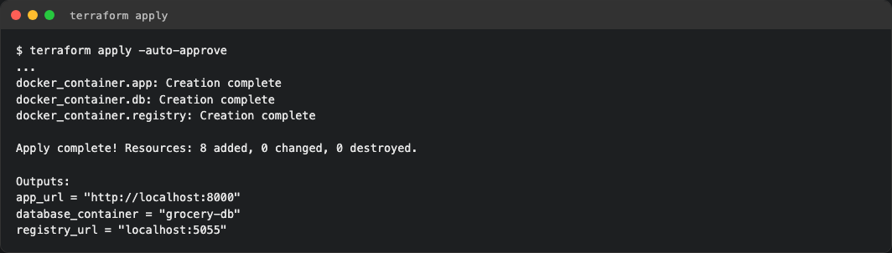 |
| `terraform output` | 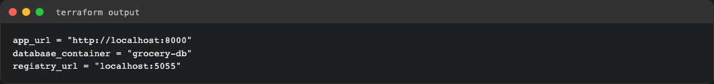 |
| `docker ps` — provisioned containers | 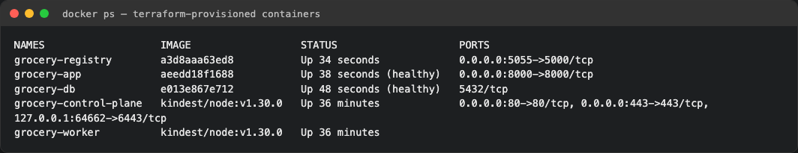 |

## 5. Kubernetes (kind)
| Evidence | Shot |
|----------|------|
| `get pods,svc,ingress,hpa` | 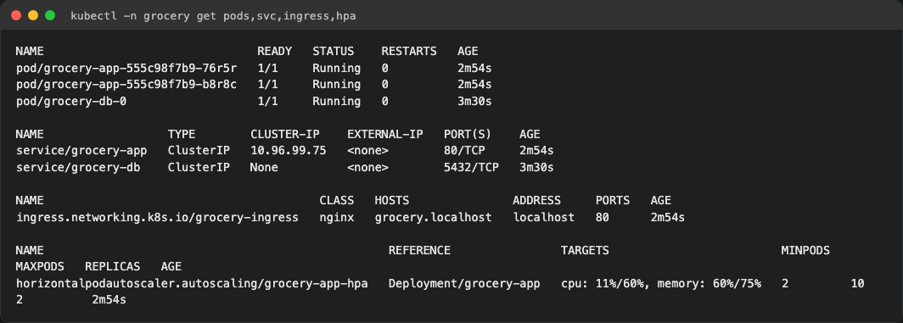 |
| Dashboard via Ingress (grocery.localhost) | 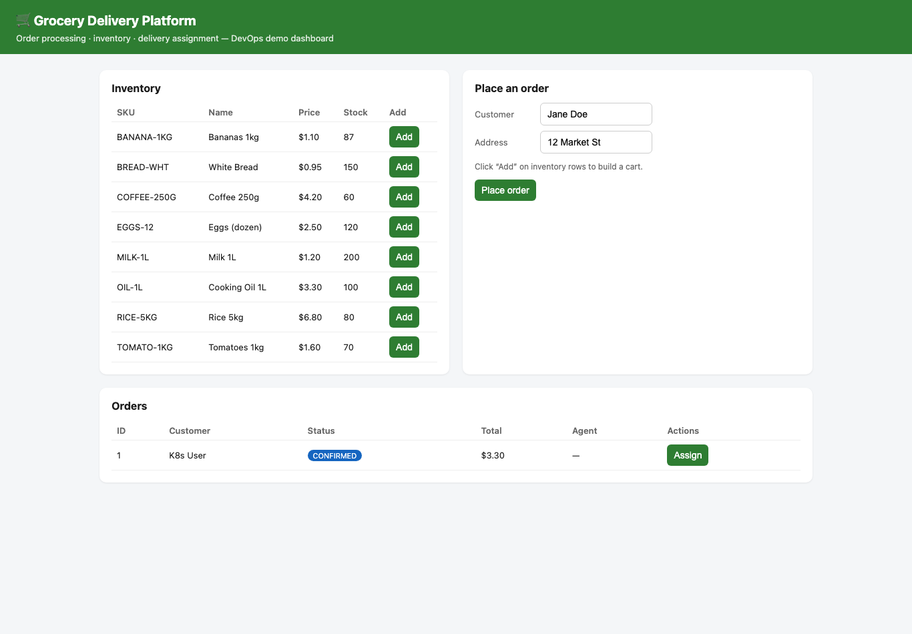 |
| HPA autoscaling 2→8 under load (CPU 457%) | 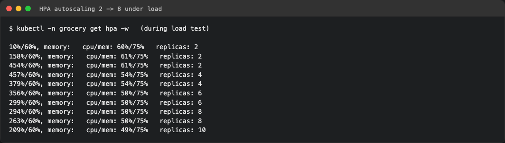 |
| HPA + pods scaled | 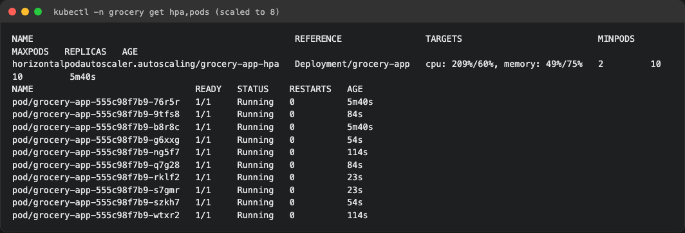 |

## 6. Monitoring & Logging
| Evidence | Shot |
|----------|------|
| Prometheus targets UP | 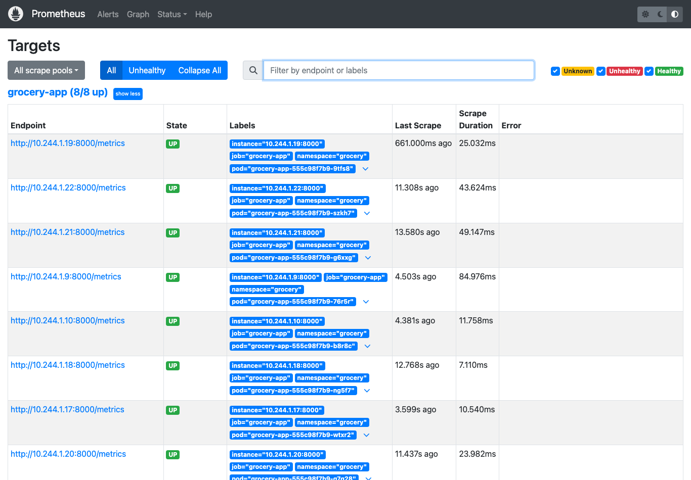 |
| Prometheus request-rate graph | 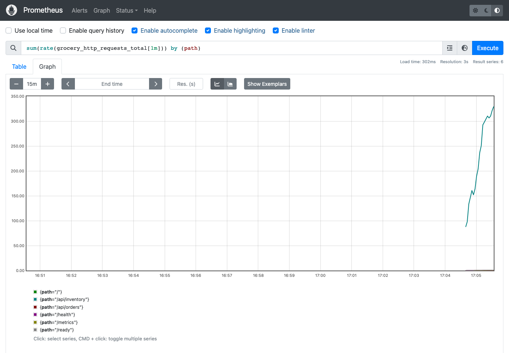 |
| Grafana dashboard (live data) | 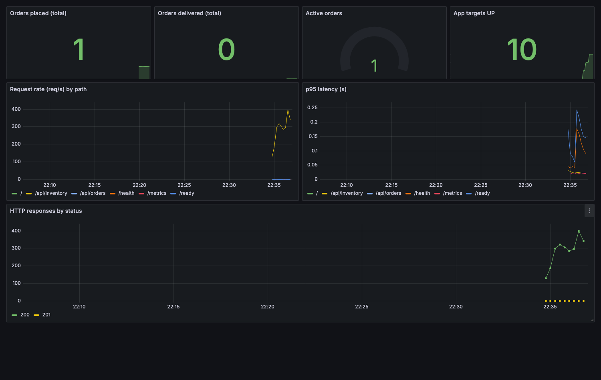 |
| Kibana Discover — grocery-logs | 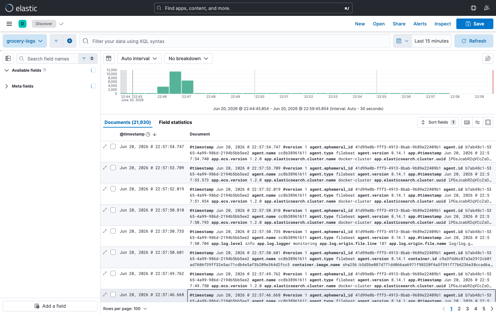 |
| Elasticsearch index | 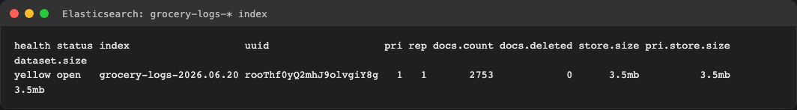 |

## 7. Vault
| Evidence | Shot |
|----------|------|
| `vault kv get secret/grocery` | 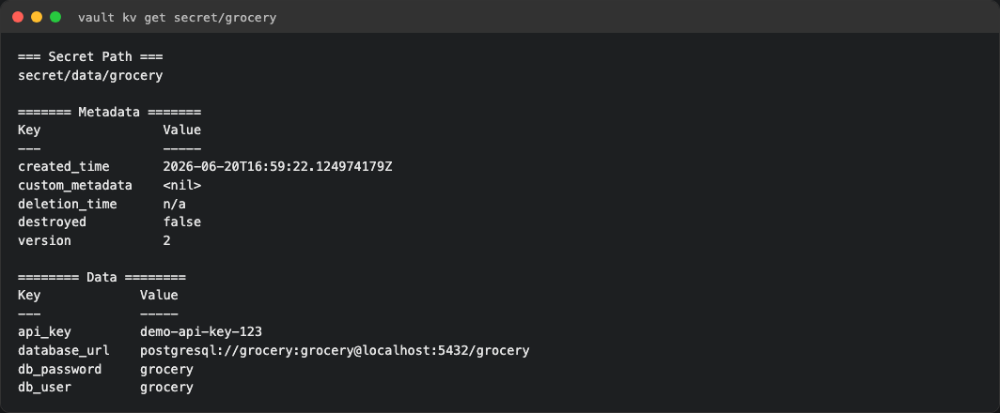 |
| App loads DB creds from Vault | 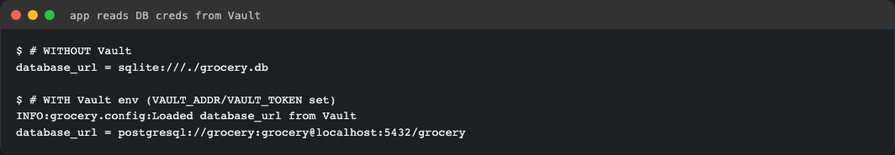 |
| Vault UI | 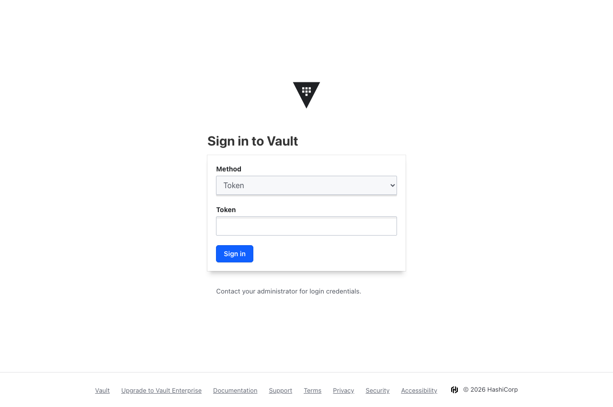 |
